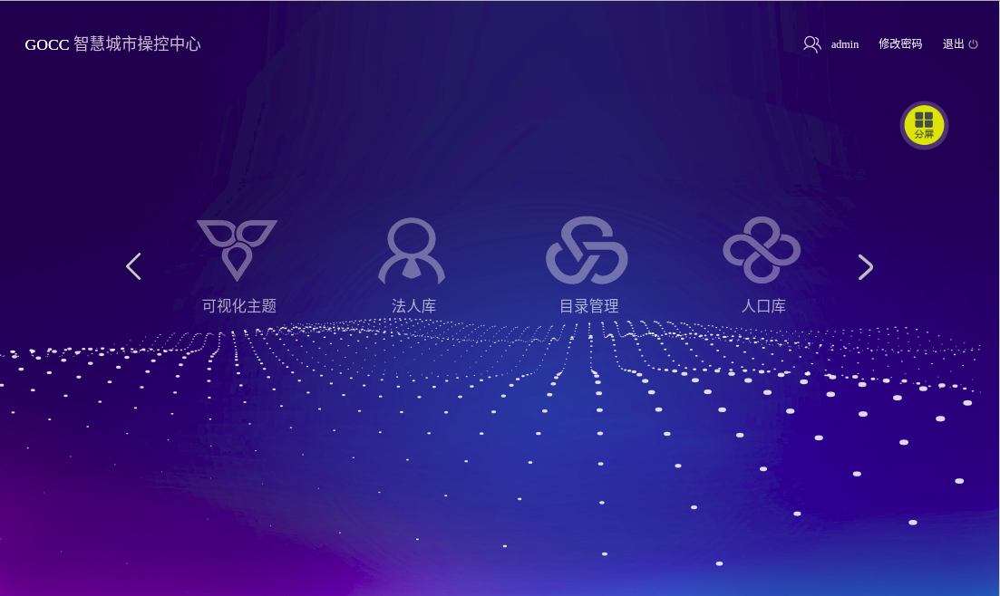
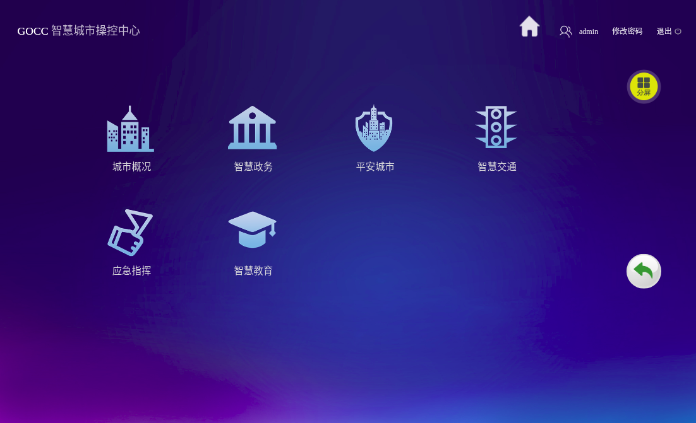
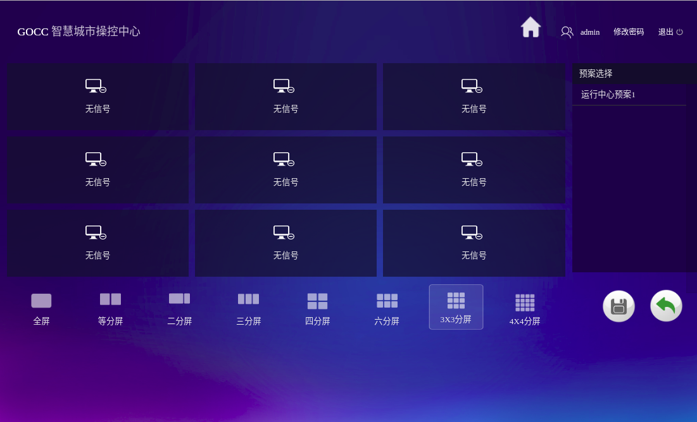

# Controler

可视化制作门户控制台

> 通过控制台操作控制大屏上的显示  

- 通过登陆页面登陆账号

- 选择首页一级菜单的内容,大屏上就会显示该菜单,此时操控台进入该菜单的子菜单

- 选择子菜单内容,大屏上就会显示该内容

- 通过下方选项选择分屏模式  
- 在各个窗口上选择系统,在大屏的对应分屏上就会展示该系统  
- 可保存当前的选择  
- 可选择之前保存的内容